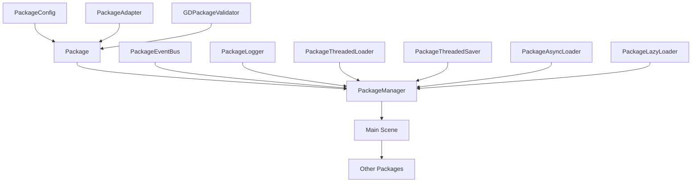

# Modular Package Framework for Godot

A lightweight, opinionated framework for creating modular, isolated packages in Godot. This system encourages decoupled development, safe experimentation, and maintainable feature layers.

---
# GDPackages - Система управления пакетами для Godot 4.6

## Содержание

1. [Введение](#введение)
2. [Быстрый старт](#быстрый-старт)
3. [Архитектура](#архитектура)
4. [Справочник API](#справочник-api)
5. [Рекомендации по использованию](#рекомендации-по-использованию)
6. [Когда использовать X, а когда Y](#когда-использовать-x-а-когда-y)
7. [Примеры хорошего и плохого кода](#примеры-хорошего-и-плохого-кода)
8. [Устранение неполадок](#устранение-неполадок)
9. [Примеры использования](#примеры-использования)

## Введение

GDPackages - это система управления пакетами для движка Godot 4.6, предназначенная для создания, загрузки и управления пакетами с поддержкой асинхронной загрузки ресурсов, событийной шины и логирования. Пакеты представляют собой модульные компоненты, которые могут содержать скрипты, ресурсы и другую логику, организованную в структурированную систему.

### Основные возможности

- Создание и управление пакетами
- Асинхронная загрузка и сохранение ресурсов
- Событийная шина для коммуникации между пакетами
- Группировка пакетов и управление зависимостями
- Логирование событий и ошибок
- _lazy_ и асинхронная загрузка пакетов
- Валидация пакетов
- Поддержка адаптеров для пакетов

## Быстрый старт

### Установка

1. Скопируйте папку `gdpackages` в директорию `addons` вашего проекта Godot.
2. Включите плагин в настройках проекта (Project -> Project Settings -> Plugins).

### Создание первого пакета

Самый быстрый способ начать использовать GDPackages - создать новый пакет через контекстное меню редактора:

```gdscript
# 1. Щелкните правой кнопкой мыши в проводнике файлов
# 2. Выберите "Package" из контекстного меню
# 3. Заполните информацию о пакете в диалоговом окне
```

### Базовое использование

```gdscript
# Загрузка пакета
var package_path = "res://addons/my_package"
PackageManager.register_package(package_path)
PackageManager.load_lazy_package("my_package")

# Получение пакета
var my_package = PackageManager.get_package("my_package")

# Использование событийной шины
my_package.emit_event("my_event", {"data": "some_value"})
my_package.subscribe_to_event("my_event", self._on_my_event)

func _on_my_event(data):
    print("Получено событие: ", data)
```

## Архитектура

### Диаграмма компонентов



### Жизненный цикл пакета

1. **Создание**: Пакет создается с определенной структурой файлов и конфигурацией
2. **Регистрация**: Пакет регистрируется в `PackageManager` для lazy-загрузки
3. **Загрузка**: Пакет загружается в память и инициализируется
4. **Использование**: Пакет взаимодействует с другими пакетами через событийную шину
5. **Выгрузка**: Пакет выгружается из памяти при завершении работы

### Структура пакета

```
my_package/
├── package_config.tres     # Конфигурация пакета
├── my_package.gd          # Основной скрипт пакета
├── my_package_adapter.gd # Адаптер пакета (опционально)
├── src/                   # Исходный код пакета
│   └── my_package_core.gd
└── ...                    # Другие ресурсы
```

## Справочник API

### Package

Базовый класс для всех пакетов в системе GDPackages.

#### Методы

**`_loaded() -> void`**
- **Описание**: Абстрактный метод, вызываемый при загрузке пакета
- **Пример**:
```gdscript
func _loaded() -> void:
    emit_message("Пакет загружен успешно")
```

**`_unloaded() -> void`**
- **Описание**: Абстрактный метод, вызываемый при выгрузке пакета
- **Пример**:
```gdscript
func _unloaded() -> void:
    emit_message("Пакет выгружен успешно")
```

**`_message(identity: String, message: String) -> void`**
- **Описание**: Абстрактный метод для обработки сообщений
- **Пример**:
```gdscript
func _message(identity: String, message: String) -> void:
    print("Сообщение от ", identity, ": ", message)
```

**`config_get_name() -> String`**
- **Описание**: Возвращает имя пакета из конфигурации
- **Пример**:
```gdscript
var package_name = my_package.config_get_name()
print("Имя пакета: ", package_name)
```

**`emit_message(message: String, identity: String = config_get_name()) -> void`**
- **Описание**: Отправляет сообщение через PackageManager
- **Пример**:
```gdscript
emit_message("Привет из пакета!")
```

**`emit_event(event_name: String, data: Variant = null) -> void`**
- **Описание**: Отправляет событие через PackageEventBus
- **Пример**:
```gdscript
emit_event("game_started", {"level": 1})
```

**`subscribe_to_event(event_name: String, callback: Callable, filter: Callable = Callable()) -> void`**
- **Описание**: Подписывается на событие через PackageEventBus
- **Пример**:
```gdscript
subscribe_to_event("player_moved", self._on_player_moved)
```

### PackageManager

Центральный класс для управления всеми пакетами в системе.

#### Статические методы

**`register_package(directory: String, group: String = "") -> bool`**
- **Описание**: Регистрирует пакет для lazy-загрузки
- **Типы аргументов**: `directory: String`, `group: String`
- **Возвращаемый тип**: `bool`
- **Пример**:
```gdscript
var success = PackageManager.register_package("res://addons/my_package", "game_packages")
if success:
    print("Пакет зарегистрирован успешно")
```

**`load_lazy_package(package_name: String, dependency_chain: Array[String] = []) -> bool`**
- **Описание**: Загружает пакет, зарегистрированный для lazy-загрузки
- **Типы аргументов**: `package_name: String`, `dependency_chain: Array[String]`
- **Возвращаемый тип**: `bool`
- **Пример**:
```gdscript
var success = PackageManager.load_lazy_package("my_package")
if success:
    print("Пакет загружен успешно")
```

**`get_package(package_name: String) -> Package`**
- **Описание**: Возвращает экземпляр пакета по имени
- **Типы аргументов**: `package_name: String`
- **Возвращаемый тип**: `Package`
- **Пример**:
```gdscript
var my_package = PackageManager.get_package("my_package")
if my_package:
    print("Пакет найден: ", my_package.config_get_name())
```

**`emit_message(identity: StringName, message: String) -> void`**
- **Описание**: Отправляет сообщение всем пакетам
- **Типы аргументов**: `identity: StringName`, `message: String`
- **Возвращаемый тип**: `void`
- **Пример**:
```gdscript
PackageManager.emit_message("GameSystem", "Игра началась")
```

**`get_packages_dependent_on(package_name: String) -> PackedStringArray`**
- **Описание**: Возвращает список пакетов, зависящих от указанного
- **Типы аргументов**: `package_name: String`
- **Возвращаемый тип**: `PackedStringArray`
- **Пример**:
```gdscript
var dependents = PackageManager.get_packages_dependent_on("core_package")
print("Зависимые пакеты: ", dependents)
```

### PackageEventBus

Глобальная система событий для коммуникации между пакетами.

#### Статические методы

**`emit(event_name: StringName, data: Variant = null, source: String = "") -> void`**
- **Описание**: Отправляет событие всем подписчикам
- **Типы аргументов**: `event_name: StringName`, `data: Variant`, `source: String`
- **Возвращаемый тип**: `void`
- **Пример**:
```gdscript
PackageEventBus.emit("player_health_changed", {"value": 50, "max": 100}, "PlayerPackage")
```

**`subscribe(event_name: StringName, callback: Callable, package_name: String = "", filter: Callable = Callable()) -> String`**
- **Описание**: Подписывается на событие
- **Типы аргументов**: `event_name: StringName`, `callback: Callable`, `package_name: String`, `filter: Callable`
- **Возвращаемый тип**: `String`
- **Пример**:
```gdscript
var sub_id = PackageEventBus.subscribe("player_health_changed", self._on_health_changed)
```

**`get_cached_events(event_name: StringName, count: int = 10) -> Array`**
- **Описание**: Возвращает кэшированные события
- **Типы аргументов**: `event_name: StringName`, `count: int`
- **Возвращаемый тип**: `Array`
- **Пример**:
```gdscript
var events = PackageEventBus.get_cached_events("player_health_changed", 5)
print("Последние события: ", events)
```

### PackageLogger

Централизованная система логирования для пакетов.

#### Статические методы

**`log_info(identity: String, message: String) -> void`**
- **Описание**: Логирует информационное сообщение
- **Типы аргументов**: `identity: String`, `message: String`
- **Возвращаемый тип**: `void`
- **Пример**:
```gdscript
PackageLogger.log_info("MyPackage", "Информация о процессе")
```

**`log_error(identity: String, message: String) -> void`**
- **Описание**: Логирует ошибку
- **Типы аргументов**: `identity: String`, `message: String`
- **Возвращаемый тип**: `void`
- **Пример**:
```gdscript
PackageLogger.log_error("MyPackage", "Произошла ошибка")
```

**`set_log_level(level: LogLevel) -> void`**
- **Описание**: Устанавливает уровень логирования
- **Типы аргументов**: `level: LogLevel`
- **Возвращаемый тип**: `void`
- **Пример**:
```gdscript
PackageLogger.set_log_level(PackageLogger.LogLevel.DEBUG)
```

### PackageConfig

Ресурс для хранения конфигурации пакета.

#### Свойства

- `name: String` - Имя пакета
- `version: String` - Версия пакета
- `description: String` - Описание пакета
- `script_path: String` - Путь к скрипту пакета
- `adapter_path: String` - Путь к адаптеру пакета
- `dependencies: PackedStringArray` - Зависимости пакета

#### Методы

**`to_dict() -> Dictionary`**
- **Описание**: Преобразует конфигурацию в словарь
- **Возвращаемый тип**: `Dictionary`
- **Пример**:
```gdscript
var config_dict = package_config.to_dict()
print("Конфигурация: ", config_dict)
```

**`from_dict(dict: Dictionary) -> void`**
- **Описание**: Инициализирует конфигурацию из словаря
- **Типы аргументов**: `dict: Dictionary`
- **Возвращаемый тип**: `void`
- **Пример**:
```gdscript
var new_config = PackageConfig.new()
new_config.from_dict({"name": "test_package", "version": "1.0"})
```

### PackageThreadedResourceManager

Singleton для многопоточной загрузки/сохранения ресурсов.

#### Статические методы

**`load_resource(key: String, path: String, type_hint: String = "", cache_mode: int = 1) -> void`**
- **Описание**: Асинхронно загружает ресурс
- **Типы аргументов**: `key: String`, `path: String`, `type_hint: String`, `cache_mode: int`
- **Возвращаемый тип**: `void`
- **Пример**:
```gdscript
PackageThreadedResourceManager.load_resource("texture1", "res://assets/texture.png")
```

**`save_resource(resource: Resource, path: String = "", flags: int = 0) -> void`**
- **Описание**: Асинхронно сохраняет ресурс
- **Типы аргументов**: `resource: Resource`, `path: String`, `flags: int`
- **Возвращаемый тип**: `void`
- **Пример**:
```gdscript
PackageThreadedResourceManager.save_resource(my_texture, "res://saved/texture.tres")
```

**`connect_load_finished(callable: Callable, flags: int = 0) -> int`**
- **Описание**: Подключается к сигналу завершения загрузки
- **Типы аргументов**: `callable: Callable`, `flags: int`
- **Возвращаемый тип**: `int`
- **Пример**:
```gdscript
PackageThreadedResourceManager.connect_load_finished(self._on_load_finished)
```

## Рекомендации по использованию

### Гранулярность пакетов

При создании пакетов следуйте принципам модульности:

1. **Одна основная функция на пакет**: Каждый пакет должен отвечать за одну конкретную функциональность
2. **Минимальные зависимости**: Сведите зависимости к минимуму для лучшей переносимости
3. **Четкие интерфейсы**: Определите четкие API для взаимодействия с другими пакетами

```gdscript
# Пример: Пакет для управления аудио
# audio_package.gd
extends Package

func _loaded() -> void:
    emit_message("Аудио-пакет загружен")

func play_sound(sound_name: String) -> void:
    # Логика воспроизведения звука
    emit_event("sound_played", {"name": sound_name})

func set_volume(volume: float) -> void:
    # Логика изменения громкости
    emit_event("volume_changed", {"value": volume})
```

### Управление зависимостями

1. **Явное указание зависимостей**: Указывайте все зависимости в конфигурации пакета
2. **Проверка наличия зависимостей**: Используйте методы PackageManager для проверки зависимостей
3. **Обработка отсутствующих зависимостей**: Обрабатывайте случаи, когда зависимости недоступны

```gdscript
# Проверка зависимостей
func check_dependencies() -> bool:
    var missing_deps = PackageManager.get_missing_dependencies(config_get_name())
    if missing_deps.size() > 0:
        emit_error("Отсутствуют зависимости: " + str(missing_deps))
        return false
    return true
```

### Кэширование ресурсов

Используйте встроенную систему кэширования для эффективной работы с ресурсами:

```gdscript
# Асинхронная загрузка с кэшированием
func load_assets() -> void:
    PackageThreadedResourceManager.load_resource("player_sprite", "res://player.png")
    PackageThreadedResourceManager.load_resource("enemy_sprite", "res://enemy.png")
    
    # Подключение к сигналу завершения загрузки
    PackageThreadedResourceManager.connect_load_finished(self._on_assets_loaded)

func _on_assets_loaded(loaded_files: Dictionary) -> void:
    var player_sprite = loaded_files.get("player_sprite")
    var enemy_sprite = loaded_files.get("enemy_sprite")
    # Использование загруженных ресурсов
```

### Тестирование пакетов

1. **Модульное тестирование**: Тестируйте отдельные компоненты пакета
2. **Интеграционное тестирование**: Тестируйте взаимодействие с другими пакетами
3. **Тестирование зависимостей**: Проверяйте работу при отсутствии зависимостей

```gdscript
# Пример тестирования
func test_package_functionality() -> void:
    # Подготовка
    var test_package = TestPackage.new()
    
    # Выполнение
    test_package._loaded()
    
    # Проверка
    assert(test_package.config_get_name() == "test_package", "Неправильное имя пакета")
```

### Рекомендации по производительности

1. **Асинхронная загрузка**: Используйте асинхронные методы для загрузки ресурсов
2. **Группировка операций**: Группируйте похожие операции для оптимизации
3. **Использование пулов потоков**: Используйте встроенные пулы потоков для многопоточных операций
4. **Контроль памяти**: Мониторьте использование памяти и очищайте ресурсы при выгрузке

```gdscript
# Оптимизация загрузки ресурсов
func optimized_load_resources() -> void:
    var resources_to_load = [
        ["texture1", "res://texture1.png"],
        ["texture2", "res://texture2.png"],
        ["texture3", "res://texture3.png"]
    ]
    
    # Загрузка группы ресурсов
    PackageThreadedResourceManager.load_resources_group("ui_textures", resources_to_load)
    
    # Подключение к сигналу завершения группы
    PackageThreadedResourceManager.connect_load_group(self._on_group_loaded)
```

## Когда использовать X, а когда Y

### emit_message vs emit_event

**Когда использовать `emit_message`:**
- Для отправки простых информационных сообщений
- Для логирования действий в системе
- Когда не требуется реакция от других пакетов
- Для отладки и мониторинга состояния

**Пример хорошего использования:**
```gdscript
# Хорошо: информирование о процессе загрузки
func _loaded() -> void:
    emit_message("Пакет успешно загружен")
```

**Когда использовать `emit_event`:**
- Для коммуникации между пакетами
- Когда требуется реакция от других пакетов
- Для передачи данных между модулями
- Для реализации событийной архитектуры

**Пример хорошего использования:**
```gdscript
# Хорошо: уведомление о смене состояния игры
func change_game_state(new_state: String) -> void:
    current_state = new_state
    emit_event("game_state_changed", {"state": new_state})
```

**Анти-паттерн:**
```gdscript
# Плохо: использование emit_message для передачи данных
func player_died() -> void:
    emit_message("player_died")  # Другие пакеты не могут подписаться на это сообщение
    # Лучше использовать emit_event("player_died", {"player_id": id})
```

### EventBus vs прямой вызов API пакета

**Когда использовать EventBus (события):**
- Для слабосвязанной архитектуры
- Когда неизвестно, какие пакеты будут реагировать
- Для уведомлений о событиях (пользовательский ввод, изменения состояния)
- Для уведомлений о системных событиях

**Пример хорошего использования:**
```gdscript
# Хорошо: слабосвязанная архитектура
# UI пакет подписывается на события игрока
func _ready() -> void:
    subscribe_to_event("player_health_changed", self._on_health_changed)

func _on_health_changed(data: Dictionary) -> void:
    update_health_bar(data.health)
```

**Когда использовать прямой вызов API:**
- Для синхронных операций
- Когда нужен результат выполнения
- Для специфичных операций, которые не должны быть общими событиями
- Для вызова функций, которые не являются событиями

**Пример хорошего использования:**
```gdscript
# Хорошо: синхронный вызов для получения данных
func get_player_position() -> Vector2:
    var game_package = PackageManager.get_package("game_logic")
    if game_package:
        return game_package.get_player_position()
    return Vector2.ZERO
```

**Анти-паттерн:**
```gdscript
# Плохо: прямой вызов другого пакета для уведомления о событии
func player_health_changed(new_health: int) -> void:
    var ui_package = PackageManager.get_package("ui_package")
    if ui_package and ui_package.has_method("_update_health_display"):
        ui_package._update_health_display(new_health)  # Создает жесткую зависимость
```

### Adapter vs публичные методы Package

**Когда использовать Adapter:**
- Для предоставления интерфейса между пакетами
- Для инкапсуляции взаимодействия с UI
- Для упрощения взаимодействия между модулями
- Когда нужно предоставить упрощенный интерфейс внешнему коду

**Пример хорошего использования:**
```gdscript
# Хорошо: адаптер как интерфейс между игровой логикой и UI
# health_adapter.gd
extends PackageAdapter

var _health_package = null

func _init(owner_name: String) -> void:
    .(owner_name)
    _health_package = PackageManager.get_package(owner_name)

func get_health() -> int:
    return _health_package.health if _health_package else 0

func take_damage(amount: int) -> void:
    if _health_package and _health_package.has_method("_take_damage"):
        _health_package._take_damage(amount)

func heal(amount: int) -> void:
    if _health_package and _health_package.has_method("_heal"):
        _health_package._heal(amount)
```

**Когда использовать публичные методы Package:**
- Для внутреннего взаимодействия пакетов
- Когда не нужна дополнительная абстракция
- Для синхронных операций внутри пакетной системы

**Пример хорошего использования:**
```gdscript
# Хорошо: прямой вызов методов пакета для внутренней логики
func _ready() -> void:
    var health_package = PackageManager.get_package("health")
    if health_package:
        health_package.set_max_health(100)
```

**Анти-паттерн:**
```gdscript
# Плохо: использование адаптера для внутренней логики пакета
func internal_calculation() -> void:
    # Не нужно использовать адаптер для внутреннего взаимодействия
    var adapter = get_package_adapter("other_package")
    adapter.some_internal_method()  # Прямой вызов был бы проще
```

### ThreadedResourceManager vs обычный load()

**Когда использовать ThreadedResourceManager:**
- Для асинхронной загрузки/сохранения ресурсов
- Когда нужно избежать задержек в главном потоке
- Для загрузки больших ресурсов (текстур, сцен, аудио)
- Для групповой загрузки ресурсов

**Пример хорошего использования:**
```gdscript
# Хорошо: асинхронная загрузка ресурсов
func load_level_resources() -> void:
    var resources_to_load = [
        ["player_model", "res://models/player.glb"],
        ["enemy_model", "res://models/enemy.glb"],
        ["level_scene", "res://levels/level1.tscn"]
    ]
    
    load_resources_group_async("level_resources", resources_to_load)
    connect_load_group(self._on_level_resources_loaded)
```

**Когда использовать обычный load():**
- Для загрузки небольших ресурсов при инициализации
- Когда ресурс нужен немедленно
- Для загрузки ресурсов в конструкторах и _ready()
- Для ресурсов, которые точно уже загружены

**Пример хорошего использования:**
```gdscript
# Хорошо: загрузка небольших ресурсов синхронно
func _ready() -> void:
    # Маленькие ресурсы, загружаются быстро
    icon_texture = load("res://ui/icon.png")
    font_resource = load("res://fonts/default.tres")
```

**Анти-паттерн:**
```gdscript
# Плохо: синхронная загрузка больших ресурсов в главном потоке
func load_level() -> void:
    # Это вызовет задержку в игре
    var large_scene = load("res://levels/complex_level.tscn")
    var large_texture = load("res://textures/large_texture.png")
```

## Примеры хорошего и плохого кода

### Хороший код: Правильное использование адаптера

```gdscript
# Хороший пример: адаптер как интерфейс между модулями и UI
# game_adapter.gd
extends PackageAdapter

var _game_package = null

func _init(owner_name: String) -> void:
    .(owner_name)
    _game_package = PackageManager.get_package(owner_name)

# Методы для взаимодействия с UI
func start_game() -> void:
    if _game_package and _game_package.has_method("_start_game"):
        _game_package._start_game()

func get_score() -> int:
    if _game_package and _game_package.has_method("_get_score"):
        return _game_package._get_score()
    return 0

func pause_game() -> void:
    if _game_package and _game_package.has_method("_pause_game"):
        _game_package._pause_game()

# UI вызывает этот адаптер для взаимодействия с игровой логикой
func on_start_button_pressed() -> void:
    start_game()
```

### Плохой код: Прямая зависимость между UI игровой логикой

```gdscript
# Плохой пример: жесткая зависимость между UI игровой логикой
# ui_package.gd
extends Package

func on_start_button_pressed() -> void:
    # Прямой вызов метода другого пакета
    var game_package = PackageManager.get_package("game_logic")
    if game_package and game_package.has_method("start_game"):
        game_package.start_game()  # Создает жесткую зависимость

func update_score_display() -> void:
    var game_package = PackageManager.get_package("game_logic")
    if game_package:
        var score = game_package.get_current_score()
        # Обновление UI
```

### Хороший код: Событийная архитектура

```gdscript
# Хороший пример: слабосвязанная архитектура через события
# game_logic_package.gd
extends Package

func player_scored(points: int) -> void:
    current_score += points
    emit_event("score_changed", {"score": current_score, "points_added": points})

func player_died() -> void:
    emit_event("player_died", {"final_score": current_score})
    emit_event("game_over", {"score": current_score, "time": get_play_time()})
```

```gdscript
# ui_package.gd - подписывается на события
extends Package

func _loaded() -> void:
    subscribe_to_event("score_changed", self._on_score_changed)
    subscribe_to_event("player_died", self._on_player_died)

func _on_score_changed(data: Dictionary) -> void:
    update_score_label(data.score)

func _on_player_died(data: Dictionary) -> void:
    show_game_over_screen(data.final_score)
```

### Плохой код: Событийная архитектура с проблемами

```gdscript
# Плохой пример: чрезмерное использование событий
# game_logic_package.gd
extends Package

func update_player_position(pos: Vector2) -> void:
    player_position = pos
    # Плохо: отправка события при каждом обновлении позиции
    emit_event("player_moved", {"position": pos})  # Может вызвать перегрузку событий

func take_damage(damage: int) -> void:
    health -= damage
    # Плохо: отправка события с пустыми данными
    emit_event("health_updated", {})  # Недостаточно информации
```

### Хороший код: Обработка ошибок

```gdscript
# Хороший пример: надежная обработка ошибок
func load_player_data() -> bool:
    var save_path = "user://player_save.json"
    
    if not FileAccess.file_exists(save_path):
        emit_warning("Файл сохранения не найден: " + save_path)
        return false
    
    var file = FileAccess.open(save_path, FileAccess.READ)
    if not file:
        emit_error("Не удалось открыть файл сохранения")
        return false
    
    var content = file.get_as_text()
    file.close()
    
    var json_result = JSON.parse_string(content)
    if not json_result or typeof(json_result) != TYPE_DICTIONARY:
        emit_error("Неверный формат файла сохранения")
        return false
    
    # Успешная загрузка данных
    player_data = json_result
    emit_message("Данные игрока загружены")
    return true
```

### Плохой код: Отсутствие обработки ошибок

```gdscript
# Плохой пример: отсутствие обработки ошибок
func load_player_data() -> void:
    # Нет проверки на существование файла
    var content = FileAccess.get_file_as_string("user://player_save.json")
    var json_result = JSON.parse_string(content)
    player_data = json_result  # Может быть null или неверного типа
    # Нет обработки ошибок, может привести к краху
```

### Хороший код: Асинхронная загрузка с обработкой ошибок

```gdscript
# Хороший пример: безопасная асинхронная загрузка
func load_level_assets(level_name: String) -> void:
    var asset_list = [
        ["level_scene", "res://levels/" + level_name + ".tscn"],
        ["level_music", "res://audio/" + level_name + "_music.ogg"],
        ["level_texture", "res://textures/" + level_name + ".png"]
    ]
    
    # Подписка на ошибки
    connect_load_error(self._on_asset_load_error)
    connect_load_finished(self._on_all_assets_loaded)
    
    # Асинхронная загрузка
    load_resources_group_async("level_" + level_name, asset_list)

func _on_asset_load_error(path: String) -> void:
    emit_error("Ошибка загрузки ресурса: " + path)
    # Логика восстановления или альтернативный путь

func _on_all_assets_loaded(loaded_files: Dictionary) -> void:
    if loaded_files.is_empty():
        emit_error("Не удалось загрузить ресурсы уровня")
        return
    
    emit_message("Ресурсы уровня загружены: " + str(loaded_files.size()))
    # Продолжение загрузки уровня
```

## Устранение неполадок

### Распространенные ошибки

#### 1. Пакет не загружается

**Проблема**: Пакет не загружается, хотя файлы существуют.

**Решение**:
- Проверьте структуру пакета (наличие `package_config.tres` и основного скрипта)
- Убедитесь, что основной скрипт наследуется от `Package`
- Проверьте зависимости пакета

```gdscript
# Проверка валидации пакета
var validation_result = GDPackageValidator.validate_package_complete("res://my_package")
if not validation_result.is_valid:
    for error in validation_result.errors:
        print("Ошибка валидации: ", error)
```

#### 2. Ошибка циклической зависимости

**Проблема**: Пакеты зависят друг от друга, создавая цикл.

**Решение**:
- Пересмотрите архитектуру зависимостей
- Используйте событийную шину для коммуникации вместо прямых зависимостей

#### 3. Ошибка при асинхронной загрузке

**Проблема**: Ошибка при использовании асинхронной загрузки ресурсов.

**Решение**:
- Проверьте правильность путей к ресурсам
- Убедитесь, что подключены сигналы завершения загрузки
- Используйте методы отладки

```gdscript
# Обработка ошибок загрузки
func load_resource_with_error_handling() -> void:
    PackageThreadedResourceManager.load_resource("my_texture", "res://missing_texture.png")
    PackageThreadedResourceManager.connect_load_error(self._on_load_error)

func _on_load_error(path: String) -> void:
    print("Ошибка загрузки ресурса: ", path)
```

### FAQ

**Q: Как создать пакет с нуля?**
A: Используйте контекстное меню редактора Godot - щелкните правой кнопкой мыши в проводнике файлов и выберите "Package".

**Q: Можно ли использовать пакеты в экспортированном проекте?**
A: Да, пакеты работают как в редакторе, так и в экспортированном проекте.

**Q: Как обновить пакет в runtime?**
A: Используйте функции горячей перезагрузки, если включена соответствующая опция в PackageManager.

**Q: Как отладить взаимодействие между пакетами?**
A: Используйте PackageLogger для логирования и PackageEventBus для мониторинга событий.

## Примеры использования

### End-to-End пример: Игровой пакет с UI

Создадим полный пример игрового пакета с пользовательским интерфейсом:

```gdscript
# health_package.gd
extends Package

var health: int = 100
var max_health: int = 100

func _loaded() -> void:
    emit_message("Пакет здоровья загружен")
    
    # Подписка на события
    subscribe_to_event("player_take_damage", self._on_player_take_damage)
    subscribe_to_event("player_heal", self._on_player_heal)
    
    # Загрузка UI ресурсов
    load_health_ui_resources()

func _unloaded() -> void:
    emit_message("Пакет здоровья выгружен")

func _message(identity: String, message: String) -> void:
    print("Сообщение от ", identity, ": ", message)

func _on_player_take_damage(data: Dictionary) -> void:
    var damage = data.get("amount", 0)
    if damage == null:
        emit_error("Получены некорректные данные урона: " + str(data))
        return
    
    health -= damage
    health = max(0, health)
    
    # Отправка события об изменении здоровья
    emit_event("health_changed", {"current": health, "max": max_health})
    
    # Обновление UI
    update_health_ui()

func _on_player_heal(data: Dictionary) -> void:
    var heal_amount = data.get("amount", 0)
    if heal_amount == null:
        emit_error("Получены некорректные данные лечения: " + str(data))
        return
        
    health += heal_amount
    health = min(max_health, health)
    
    # Отправка события об изменении здоровья
    emit_event("health_changed", {"current": health, "max": max_health})
    
    # Обновление UI
    update_health_ui()

func load_health_ui_resources() -> void:
    # Асинхронная загрузка UI ресурсов
    load_resource_async("health_bar_texture", "res://ui/health_bar.png")
    load_resource_async("health_fill_texture", "res://ui/health_fill.png")
    
    # Подключение к сигналу завершения загрузки
    connect_load_finished(self._on_ui_resources_loaded)

func _on_ui_resources_loaded(loaded_files: Dictionary) -> void:
    emit_message("UI ресурсы здоровья загружены")
    create_health_ui()

func create_health_ui() -> void:
    # Создание UI элементов (в реальном проекте здесь будет создание контролов)
    emit_message("UI здоровья создано")

func update_health_ui() -> void:
    # Обновление UI (в реальном проекте здесь будет обновление контролов)
    var health_percent = float(health) / float(max_health) * 100
    emit_message("UI здоровья обновлено: " + str(health_percent) + "%")

func _error(identity: String, message: String) -> bool:
    emit_message("Ошибка обработана: " + message)
    return true

func _unhandled_error(identity: String, message: String) -> void:
    emit_message("Необработанная ошибка: " + message)

func _handled_error(identity: String, message: String) -> void:
    emit_message("Обработанная ошибка: " + message)
```

```gdscript
# Использование пакета здоровья в игровом сценарии
extends Node

func _ready() -> void:
    # Регистрация и загрузка пакета здоровья
    var health_package_path = "res://packages/health_package"
    PackageManager.register_package(health_package_path)
    var success = PackageManager.load_lazy_package("health_package")
    
    if success:
        var health_package = PackageManager.get_package("health_package")
        if health_package:
            # Подписка на события изменения здоровья
            health_package.subscribe_to_event("health_changed", self._on_health_changed)
            
            # Симуляция получения урона
            health_package.emit_event("player_take_damage", {"amount": 25})
            
            # Симуляция лечения
            health_package.emit_event("player_heal", {"amount": 10})
        else:
            print("Ошибка: пакет здоровья не найден после загрузки")
    else:
        print("Ошибка: не удалось загрузить пакет здоровья")

func _on_health_changed(data: Dictionary) -> void:
    var current = data.get("current", 0)
    var max = data.get("max", 100)
    print("Здоровье изменено: ", current, "/", max)
```

### Пример: Многопоточная загрузка ресурсов

```gdscript
# asset_loader_package.gd
extends Package

func _loaded() -> void:
    emit_message("Пакет загрузки ресурсов загружен")
    load_game_assets()

func load_game_assets() -> void:
    # Определение ресурсов для загрузки
    var textures_to_load = [
        ["player_sprite", "res://assets/player.png"],
        ["enemy_sprite", "res://assets/enemy.png"],
        ["background", "res://assets/background.png"],
        ["ui_button", "res://assets/ui/button.png"]
    ]
    
    var scenes_to_load = [
        ["level_1", "res://scenes/level_1.tscn"],
        ["menu", "res://scenes/menu.tscn"]
    ]
    
    # Загрузка текстур
    load_resources_group_async("textures", textures_to_load)
    
    # Загрузка сцен
    load_resources_group_async("scenes", scenes_to_load)
    
    # Подключение к сигналам завершения
    connect_load_group(self._on_assets_loaded)
    connect_load_finished(self._on_all_assets_loaded)

func _on_assets_loaded(group_name: String, loaded: Dictionary, failed: Dictionary) -> void:
    emit_message("Группа ресурсов загружена: " + group_name)
    if failed.size() > 0:
        emit_warning("Не удалось загрузить: " + str(failed.keys()))

func _on_all_assets_loaded(loaded_files: Dictionary) -> void:
    emit_message("Все ресурсы загружены. Количество: " + str(loaded_files.size()))
    
    # Использование загруженных ресурсов
    var player_sprite = loaded_files.get("player_sprite")
    var level_scene = loaded_files.get("level_1")
    
    if player_sprite:
        emit_message("Спрайт игрока загружен")
    if level_scene:
        emit_message("Сцена уровня 1 загружена")
```

### Пример: Валидация пакета

```gdscript
# package_validator_example.gd
extends Node

func validate_my_package() -> void:
    var package_path = "res://packages/my_game_package"
    var result = GDPackageValidator.validate_package_complete(package_path)
    
    if result.is_valid:
        print("Пакет валиден!")
        for warning in result.warnings:
            print("Предупреждение: ", warning)
    else:
        print("Пакет НЕ валиден!")
        for error in result.errors:
            print("Ошибка: ", error)
        for warning in result.warnings:
            print("Предупреждение: ", warning)
```

Эти примеры демонстрируют полный цикл работы с GDPackages - от создания пакетов до их использования в игровой логике с асинхронной загрузкой ресурсов и коммуникацией через событийную шину.
