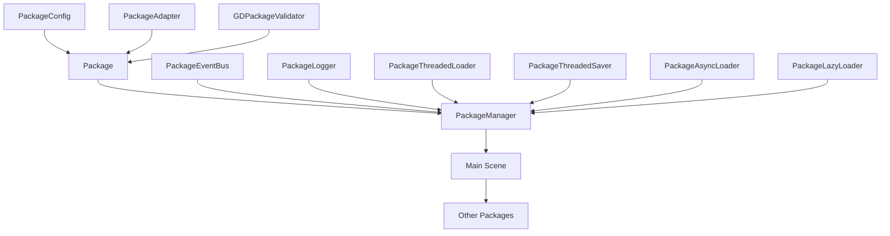

# Modular Package Framework for Godot

A lightweight, opinionated framework for creating modular, isolated packages in Godot. This system encourages decoupled development, safe experimentation, and maintainable feature layers.

---
# GDPackages - Package Management System for Godot 4.6

## Table of Contents

1. [Introduction](#introduction)
2. [Quick Start](#quick-start)
3. [Architecture](#architecture)
4. [API Reference](#api-reference)
5. [Usage Guidelines](#usage-guidelines)
6. [When to Use X vs Y](#when-to-use-x-vs-y)
7. [Good and Bad Code Examples](#good-and-bad-code-examples)
8. [Troubleshooting](#troubleshooting)
9. [Usage Examples](#usage-examples)

## Introduction

GDPackages is a package management system for the Godot 4.6 engine designed for creating, loading, and managing packages with support for asynchronous resource loading, event bus, and logging. Packages are modular components that can contain scripts, resources, and other logic organized in a structured system.

### Key Features

- Creating and managing packages
- Asynchronous loading and saving of resources
- Event bus for communication between packages
- Grouping packages and managing dependencies
- Logging events and errors
- Lazy and asynchronous loading of packages
- Package validation
- Support for package adapters

## Quick Start

### Installation

1. Copy the `gdpackages` folder to your Godot project's `addons` directory.
2. Enable the plugin in project settings (Project -> Project Settings -> Plugins).

### Creating Your First Package

The fastest way to start using GDPackages is to create a new package via the editor's context menu:

```gdscript
# 1. Right-click in the file explorer
# 2. Select "Package" from the context menu
# 3. Fill in package information in the dialog
```

### Basic Usage

```gdscript
# Loading a package
var package_path = "res://addons/my_package"
PackageManager.register_package(package_path)
PackageManager.load_lazy_package("my_package")

# Getting a package
var my_package = PackageManager.get_package("my_package")

# Using the event bus
my_package.emit_event("my_event", {"data": "some_value"})
my_package.subscribe_to_event("my_event", self._on_my_event)

func _on_my_event(data):
    print("Received event: ", data)
```

## Architecture

### Component Diagram


```mermaid
graph TD
    A[Package] --> B[PackageManager]
    C[PackageEventBus] --> B
    D[PackageLogger] --> B
    E[PackageConfig] --> A
    F[PackageAdapter] --> A
    G[PackageThreadedLoader] --> B
    H[PackageThreadedSaver] --> B
    I[PackageAsyncLoader] --> B
    J[PackageLazyLoader] --> B
    K[GDPackageValidator] --> A
    
    B --> M[Main Scene]
    M --> N[Other Packages]
```

### Package Lifecycle

1. **Creation**: A package is created with a specific file structure and configuration
2. **Registration**: The package is registered in `PackageManager` for lazy loading
3. **Loading**: The package is loaded into memory and initialized
4. **Usage**: The package interacts with other packages through the event bus
5. **Unloading**: The package is unloaded from memory when shutting down

### Package Structure

```
my_package/
├── package_config.tres     # Package configuration
├── my_package.gd          # Main package script
├── my_package_adapter.gd # Package adapter (optional)
├── src/                   # Package source code
│   └── my_package_core.gd
└── ...                    # Other resources
```

## API Reference

### Package

Base class for all packages in the GDPackages system.

#### Methods

**`_loaded() -> void`**
- **Description**: Abstract method called when the package is loaded
- **Example**:
```gdscript
func _loaded() -> void:
    emit_message("Package loaded successfully")
```

**`_unloaded() -> void`**
- **Description**: Abstract method called when the package is unloaded
- **Example**:
```gdscript
func _unloaded() -> void:
    emit_message("Package unloaded successfully")
```

**`_message(identity: String, message: String) -> void`**
- **Description**: Abstract method for handling messages
- **Example**:
```gdscript
func _message(identity: String, message: String) -> void:
    print("Message from ", identity, ": ", message)
```

**`config_get_name() -> String`**
- **Description**: Returns the package name from the configuration
- **Example**:
```gdscript
var package_name = my_package.config_get_name()
print("Package name: ", package_name)
```

**`emit_message(message: String, identity: String = config_get_name()) -> void`**
- **Description**: Sends a message through PackageManager
- **Example**:
```gdscript
emit_message("Hello from package!")
```

**`emit_event(event_name: String, data: Variant = null) -> void`**
- **Description**: Sends an event through PackageEventBus
- **Example**:
```gdscript
emit_event("game_started", {"level": 1})
```

**`subscribe_to_event(event_name: String, callback: Callable, filter: Callable = Callable()) -> void`**
- **Description**: Subscribes to an event through PackageEventBus
- **Example**:
```gdscript
subscribe_to_event("player_moved", self._on_player_moved)
```

### PackageManager

Central class for managing all packages in the system.

#### Static Methods

**`register_package(directory: String, group: String = "") -> bool`**
- **Description**: Registers a package for lazy loading
- **Argument Types**: `directory: String`, `group: String`
- **Return Type**: `bool`
- **Example**:
```gdscript
var success = PackageManager.register_package("res://addons/my_package", "game_packages")
if success:
    print("Package registered successfully")
```

**`load_lazy_package(package_name: String, dependency_chain: Array[String] = []) -> bool`**
- **Description**: Loads a package registered for lazy loading
- **Argument Types**: `package_name: String`, `dependency_chain: Array[String]`
- **Return Type**: `bool`
- **Example**:
```gdscript
var success = PackageManager.load_lazy_package("my_package")
if success:
    print("Package loaded successfully")
```

**`get_package(package_name: String) -> Package`**
- **Description**: Returns a package instance by name
- **Argument Types**: `package_name: String`
- **Return Type**: `Package`
- **Example**:
```gdscript
var my_package = PackageManager.get_package("my_package")
if my_package:
    print("Package found: ", my_package.config_get_name())
```

**`emit_message(identity: StringName, message: String) -> void`**
- **Description**: Sends a message to all packages
- **Argument Types**: `identity: StringName`, `message: String`
- **Return Type**: `void`
- **Example**:
```gdscript
PackageManager.emit_message("GameSystem", "Game started")
```

**`get_packages_dependent_on(package_name: String) -> PackedStringArray`**
- **Description**: Returns a list of packages that depend on the specified one
- **Argument Types**: `package_name: String`
- **Return Type**: `PackedStringArray`
- **Example**:
```gdscript
var dependents = PackageManager.get_packages_dependent_on("core_package")
print("Dependent packages: ", dependents)
```

### PackageEventBus

Global event system for communication between packages.

#### Static Methods

**`emit(event_name: StringName, data: Variant = null, source: String = "") -> void`**
- **Description**: Sends an event to all subscribers
- **Argument Types**: `event_name: StringName`, `data: Variant`, `source: String`
- **Return Type**: `void`
- **Example**:
```gdscript
PackageEventBus.emit("player_health_changed", {"value": 50, "max": 100}, "PlayerPackage")
```

**`subscribe(event_name: StringName, callback: Callable, package_name: String = "", filter: Callable = Callable()) -> String`**
- **Description**: Subscribes to an event
- **Argument Types**: `event_name: StringName`, `callback: Callable`, `package_name: String`, `filter: Callable`
- **Return Type**: `String`
- **Example**:
```gdscript
var sub_id = PackageEventBus.subscribe("player_health_changed", self._on_health_changed)
```

**`get_cached_events(event_name: StringName, count: int = 10) -> Array`**
- **Description**: Returns cached events
- **Argument Types**: `event_name: StringName`, `count: int`
- **Return Type**: `Array`
- **Example**:
```gdscript
var events = PackageEventBus.get_cached_events("player_health_changed", 5)
print("Recent events: ", events)
```

### PackageLogger

Centralized logging system for packages.

#### Static Methods

**`log_info(identity: String, message: String) -> void`**
- **Description**: Logs an informational message
- **Argument Types**: `identity: String`, `message: String`
- **Return Type**: `void`
- **Example**:
```gdscript
PackageLogger.log_info("MyPackage", "Process information")
```

**`log_error(identity: String, message: String) -> void`**
- **Description**: Logs an error
- **Argument Types**: `identity: String`, `message: String`
- **Return Type**: `void`
- **Example**:
```gdscript
PackageLogger.log_error("MyPackage", "An error occurred")
```

**`set_log_level(level: LogLevel) -> void`**
- **Description**: Sets the logging level
- **Argument Types**: `level: LogLevel`
- **Return Type**: `void`
- **Example**:
```gdscript
PackageLogger.set_log_level(PackageLogger.LogLevel.DEBUG)
```

### PackageConfig

Resource for storing package configuration.

#### Properties

- `name: String` - Package name
- `version: String` - Package version
- `description: String` - Package description
- `script_path: String` - Path to the package script
- `adapter_path: String` - Path to the package adapter
- `dependencies: PackedStringArray` - Package dependencies

#### Methods

**`to_dict() -> Dictionary`**
- **Description**: Converts the configuration to a dictionary
- **Return Type**: `Dictionary`
- **Example**:
```gdscript
var config_dict = package_config.to_dict()
print("Configuration: ", config_dict)
```

**`from_dict(dict: Dictionary) -> void`**
- **Description**: Initializes the configuration from a dictionary
- **Argument Types**: `dict: Dictionary`
- **Return Type**: `void`
- **Example**:
```gdscript
var new_config = PackageConfig.new()
new_config.from_dict({"name": "test_package", "version": "1.0"})
```

### PackageThreadedResourceManager

Singleton for multithreaded loading/saving of resources.

#### Static Methods

**`load_resource(key: String, path: String, type_hint: String = "", cache_mode: int = 1) -> void`**
- **Description**: Asynchronously loads a resource
- **Argument Types**: `key: String`, `path: String`, `type_hint: String`, `cache_mode: int`
- **Return Type**: `void`
- **Example**:
```gdscript
PackageThreadedResourceManager.load_resource("texture1", "res://assets/texture.png")
```

**`save_resource(resource: Resource, path: String = "", flags: int = 0) -> void`**
- **Description**: Asynchronously saves a resource
- **Argument Types**: `resource: Resource`, `path: String`, `flags: int`
- **Return Type**: `void`
- **Example**:
```gdscript
PackageThreadedResourceManager.save_resource(my_texture, "res://saved/texture.tres")
```

**`connect_load_finished(callable: Callable, flags: int = 0) -> int`**
- **Description**: Connects to the load completion signal
- **Argument Types**: `callable: Callable`, `flags: int`
- **Return Type**: `int`
- **Example**:
```gdscript
PackageThreadedResourceManager.connect_load_finished(self._on_load_finished)
```

## Usage Guidelines

### Package Granularity

When creating packages, follow modularity principles:

1. **One main function per package**: Each package should be responsible for one specific functionality
2. **Minimal dependencies**: Minimize dependencies for better portability
3. **Clear interfaces**: Define clear APIs for interaction with other packages

```gdscript
# Example: Package for audio management
# audio_package.gd
extends Package

func _loaded() -> void:
    emit_message("Audio package loaded")

func play_sound(sound_name: String) -> void:
    # Sound playback logic
    emit_event("sound_played", {"name": sound_name})

func set_volume(volume: float) -> void:
    # Volume adjustment logic
    emit_event("volume_changed", {"value": volume})
```

### Dependency Management

1. **Explicit dependency specification**: Specify all dependencies in the package configuration
2. **Dependency availability checking**: Use PackageManager methods to check dependencies
3. **Handling missing dependencies**: Handle cases where dependencies are unavailable

```gdscript
# Dependency checking
func check_dependencies() -> bool:
    var missing_deps = PackageManager.get_missing_dependencies(config_get_name())
    if missing_deps.size() > 0:
        emit_error("Missing dependencies: " + str(missing_deps))
        return false
    return true
```

### Resource Caching

Use the built-in caching system for efficient resource management:

```gdscript
# Asynchronous loading with caching
func load_assets() -> void:
    PackageThreadedResourceManager.load_resource("player_sprite", "res://player.png")
    PackageThreadedResourceManager.load_resource("enemy_sprite", "res://enemy.png")
    
    # Connecting to the load completion signal
    PackageThreadedResourceManager.connect_load_finished(self._on_assets_loaded)

func _on_assets_loaded(loaded_files: Dictionary) -> void:
    var player_sprite = loaded_files.get("player_sprite")
    var enemy_sprite = loaded_files.get("enemy_sprite")
    # Using loaded resources
```

### Package Testing

1. **Unit testing**: Test individual package components
2. **Integration testing**: Test interaction with other packages
3. **Dependency testing**: Verify functionality when dependencies are missing

```gdscript
# Testing example
func test_package_functionality() -> void:
    # Setup
    var test_package = TestPackage.new()
    
    # Execution
    test_package._loaded()
    
    # Verification
    assert(test_package.config_get_name() == "test_package", "Incorrect package name")
```

### Performance Guidelines

1. **Asynchronous loading**: Use asynchronous methods for resource loading
2. **Operation grouping**: Group similar operations for optimization
3. **Thread pool usage**: Use built-in thread pools for multithreaded operations
4. **Memory control**: Monitor memory usage and clean up resources on unload

```gdscript
# Resource loading optimization
func optimized_load_resources() -> void:
    var resources_to_load = [
        ["texture1", "res://texture1.png"],
        ["texture2", "res://texture2.png"],
        ["texture3", "res://texture3.png"]
    ]
    
    # Loading a group of resources
    PackageThreadedResourceManager.load_resources_group("ui_textures", resources_to_load)
    
    # Connecting to the group completion signal
    PackageThreadedResourceManager.connect_load_group(self._on_group_loaded)
```

## When to Use X vs Y

### emit_message vs emit_event

**When to use `emit_message`:**
- For sending simple informational messages
- For logging actions in the system
- When no reaction from other packages is required
- For debugging and state monitoring

**Example of good usage:**
```gdscript
# Good: informing about loading progress
func _loaded() -> void:
    emit_message("Package loaded successfully")
```

**When to use `emit_event`:**
- For communication between packages
- When a reaction from other packages is required
- For passing data between modules
- For implementing event-driven architecture

**Example of good usage:**
```gdscript
# Good: notifying about game state change
func change_game_state(new_state: String) -> void:
    current_state = new_state
    emit_event("game_state_changed", {"state": new_state})
```

**Anti-pattern:**
```gdscript
# Bad: using emit_message for data transfer
func player_died() -> void:
    emit_message("player_died")  # Other packages cannot subscribe to this message
    # Better to use emit_event("player_died", {"player_id": id})
```

### EventBus vs Direct Package API Call

**When to use EventBus (events):**
- For loosely-coupled architecture
- When it's unknown which packages will react
- For notifications about events (user input, state changes)
- For notifications about system events

**Example of good usage:**
```gdscript
# Good: loosely-coupled architecture
# UI package subscribes to player events
func _ready() -> void:
    subscribe_to_event("player_health_changed", self._on_health_changed)

func _on_health_changed(data: Dictionary) -> void:
    update_health_bar(data.health)
```

**When to use direct API calls:**
- For synchronous operations
- When execution results are needed
- For specific operations that shouldn't be common events
- For calling functions that aren't events

**Example of good usage:**
```gdscript
# Good: synchronous call to get data
func get_player_position() -> Vector2:
    var game_package = PackageManager.get_package("game_logic")
    if game_package:
        return game_package.get_player_position()
    return Vector2.ZERO
```

**Anti-pattern:**
```gdscript
# Bad: direct call to another package for event notification
func player_health_changed(new_health: int) -> void:
    var ui_package = PackageManager.get_package("ui_package")
    if ui_package and ui_package.has_method("_update_health_display"):
        ui_package._update_health_display(new_health)  # Creates tight coupling
```

### Adapter vs Public Package Methods

**When to use Adapter:**
- To provide an interface between packages
- To encapsulate UI interaction
- To simplify interaction between modules
- When providing a simplified interface to external code

**Example of good usage:**
```gdscript
# Good: adapter as interface between game logic and UI
# health_adapter.gd
extends PackageAdapter

var _health_package = null

func _init(owner_name: String) -> void:
    .(owner_name)
    _health_package = PackageManager.get_package(owner_name)

func get_health() -> int:
    return _health_package.health if _health_package else 0

func take_damage(amount: int) -> void:
    if _health_package and _health_package.has_method("_take_damage"):
        _health_package._take_damage(amount)

func heal(amount: int) -> void:
    if _health_package and _health_package.has_method("_heal"):
        _health_package._heal(amount)
```

**When to use public Package methods:**
- For internal package interaction
- When no additional abstraction is needed
- For synchronous operations within the package system

**Example of good usage:**
```gdscript
# Good: direct package method calls for internal logic
func _ready() -> void:
    var health_package = PackageManager.get_package("health")
    if health_package:
        health_package.set_max_health(100)
```

**Anti-pattern:**
```gdscript
# Bad: using adapter for internal package logic
func internal_calculation() -> void:
    # No need to use adapter for internal interaction
    var adapter = get_package_adapter("other_package")
    adapter.some_internal_method()  # Direct call would be simpler
```

### ThreadedResourceManager vs regular load()

**When to use ThreadedResourceManager:**
- For asynchronous resource loading/saving
- When avoiding delays in the main thread
- For loading large resources (textures, scenes, audio)
- For batch loading of resources

**Example of good usage:**
```gdscript
# Good: asynchronous resource loading
func load_level_resources() -> void:
    var resources_to_load = [
        ["player_model", "res://models/player.glb"],
        ["enemy_model", "res://models/enemy.glb"],
        ["level_scene", "res://levels/level1.tscn"]
    ]
    
    load_resources_group_async("level_resources", resources_to_load)
    connect_load_group(self._on_level_resources_loaded)
```

**When to use regular load():**
- For loading small resources during initialization
- When the resource is needed immediately
- For loading resources in constructors and _ready()
- For resources that are definitely already loaded

**Example of good usage:**
```gdscript
# Good: synchronous loading of small resources
func _ready() -> void:
    # Small resources that load quickly
    icon_texture = load("res://ui/icon.png")
    font_resource = load("res://fonts/default.tres")
```

**Anti-pattern:**
```gdscript
# Bad: synchronous loading of large resources in main thread
func load_level() -> void:
    # This will cause delays in the game
    var large_scene = load("res://levels/complex_level.tscn")
    var large_texture = load("res://textures/large_texture.png")
```

## Good and Bad Code Examples

### Good Code: Proper Adapter Usage

```gdscript
# Good example: adapter as interface between modules and UI
# game_adapter.gd
extends PackageAdapter

var _game_package = null

func _init(owner_name: String) -> void:
    .(owner_name)
    _game_package = PackageManager.get_package(owner_name)

# Methods for UI interaction
func start_game() -> void:
    if _game_package and _game_package.has_method("_start_game"):
        _game_package._start_game()

func get_score() -> int:
    if _game_package and _game_package.has_method("_get_score"):
        return _game_package._get_score()
    return 0

func pause_game() -> void:
    if _game_package and _game_package.has_method("_pause_game"):
        _game_package._pause_game()

# UI calls this adapter to interact with game logic
func on_start_button_pressed() -> void:
    start_game()
```

### Bad Code: Direct Dependency Between UI and Game Logic

```gdscript
# Bad example: tight coupling between UI and game logic
# ui_package.gd
extends Package

func on_start_button_pressed() -> void:
    # Direct call to another package's method
    var game_package = PackageManager.get_package("game_logic")
    if game_package and game_package.has_method("start_game"):
        game_package.start_game()  # Creates tight coupling

func update_score_display() -> void:
    var game_package = PackageManager.get_package("game_logic")
    if game_package:
        var score = game_package.get_current_score()
        # Updating UI
```

### Good Code: Event-Driven Architecture

```gdscript
# Good example: loosely-coupled architecture through events
# game_logic_package.gd
extends Package

func player_scored(points: int) -> void:
    current_score += points
    emit_event("score_changed", {"score": current_score, "points_added": points})

func player_died() -> void:
    emit_event("player_died", {"final_score": current_score})
    emit_event("game_over", {"score": current_score, "time": get_play_time()})
```

```gdscript
# ui_package.gd - subscribes to events
extends Package

func _loaded() -> void:
    subscribe_to_event("score_changed", self._on_score_changed)
    subscribe_to_event("player_died", self._on_player_died)

func _on_score_changed(data: Dictionary) -> void:
    update_score_label(data.score)

func _on_player_died(data: Dictionary) -> void:
    show_game_over_screen(data.final_score)
```

### Bad Code: Event-Driven Architecture with Issues

```gdscript
# Bad example: excessive use of events
# game_logic_package.gd
extends Package

func update_player_position(pos: Vector2) -> void:
    player_position = pos
    # Bad: sending event on every position update
    emit_event("player_moved", {"position": pos})  # May cause event overload

func take_damage(damage: int) -> void:
    health -= damage
    # Bad: sending event with empty data
    emit_event("health_updated", {})  # Insufficient information
```

### Good Code: Error Handling

```gdscript
# Good example: robust error handling
func load_player_data() -> bool:
    var save_path = "user://player_save.json"
    
    if not FileAccess.file_exists(save_path):
        emit_warning("Save file not found: " + save_path)
        return false
    
    var file = FileAccess.open(save_path, FileAccess.READ)
    if not file:
        emit_error("Could not open save file")
        return false
    
    var content = file.get_as_text()
    file.close()
    
    var json_result = JSON.parse_string(content)
    if not json_result or typeof(json_result) != TYPE_DICTIONARY:
        emit_error("Invalid save file format")
        return false
    
    # Successful data loading
    player_data = json_result
    emit_message("Player data loaded")
    return true
```

### Bad Code: Lack of Error Handling

```gdscript
# Bad example: lack of error handling
func load_player_data() -> void:
    # No file existence check
    var content = FileAccess.get_file_as_string("user://player_save.json")
    var json_result = JSON.parse_string(content)
    player_data = json_result  # May be null or wrong type
    # No error handling, may cause crash
```

### Good Code: Asynchronous Loading with Error Handling

```gdscript
# Good example: safe asynchronous loading
func load_level_assets(level_name: String) -> void:
    var asset_list = [
        ["level_scene", "res://levels/" + level_name + ".tscn"],
        ["level_music", "res://audio/" + level_name + "_music.ogg"],
        ["level_texture", "res://textures/" + level_name + ".png"]
    ]
    
    # Subscribing to errors
    connect_load_error(self._on_asset_load_error)
    connect_load_finished(self._on_all_assets_loaded)
    
    # Asynchronous loading
    load_resources_group_async("level_" + level_name, asset_list)

func _on_asset_load_error(path: String) -> void:
    emit_error("Resource loading error: " + path)
    # Recovery logic or alternative path

func _on_all_assets_loaded(loaded_files: Dictionary) -> void:
    if loaded_files.is_empty():
        emit_error("Could not load level resources")
        return
    
    emit_message("Level resources loaded: " + str(loaded_files.size()))
    # Continue level loading
```

## Troubleshooting

### Common Errors

#### 1. Package doesn't load

**Problem**: Package doesn't load even though files exist.

**Solution**:
- Check package structure (presence of `package_config.tres` and main script)
- Ensure main script inherits from `Package`
- Check package dependencies

```gdscript
# Package validation check
var validation_result = GDPackageValidator.validate_package_complete("res://my_package")
if not validation_result.is_valid:
    for error in validation_result.errors:
        print("Validation error: ", error)
```

#### 2. Circular dependency error

**Problem**: Packages depend on each other, creating a cycle.

**Solution**:
- Review dependency architecture
- Use event bus for communication instead of direct dependencies

#### 3. Asynchronous loading error

**Problem**: Error when using asynchronous resource loading.

**Solution**:
- Check resource path correctness
- Ensure load completion signals are connected
- Use debugging methods

```gdscript
# Load error handling
func load_resource_with_error_handling() -> void:
    PackageThreadedResourceManager.load_resource("my_texture", "res://missing_texture.png")
    PackageThreadedResourceManager.connect_load_error(self._on_load_error)

func _on_load_error(path: String) -> void:
    print("Resource loading error: ", path)
```

### FAQ

**Q: How do I create a package from scratch?**
A: Use Godot editor's context menu - right-click in the file explorer and select "Package".

**Q: Can packages be used in exported projects?**
A: Yes, packages work both in the editor and in exported projects.

**Q: How do I update a package at runtime?**
A: Use hot reload functions if the appropriate option is enabled in PackageManager.

**Q: How do I debug package interactions?**
A: Use PackageLogger for logging and PackageEventBus for monitoring events.

## Usage Examples

### End-to-End Example: Game Package with UI

Create a complete example of a game package with user interface:

```gdscript
# health_package.gd
extends Package

var health: int = 100
var max_health: int = 100

func _loaded() -> void:
    emit_message("Health package loaded")
    
    # Event subscription
    subscribe_to_event("player_take_damage", self._on_player_take_damage)
    subscribe_to_event("player_heal", self._on_player_heal)
    
    # Loading UI resources
    load_health_ui_resources()

func _unloaded() -> void:
    emit_message("Health package unloaded")

func _message(identity: String, message: String) -> void:
    print("Message from ", identity, ": ", message)

func _on_player_take_damage(data: Dictionary) -> void:
    var damage = data.get("amount", 0)
    if damage == null:
        emit_error("Invalid damage data received: " + str(data))
        return
    
    health -= damage
    health = max(0, health)
    
    # Sending event about health change
    emit_event("health_changed", {"current": health, "max": max_health})
    
    # Updating UI
    update_health_ui()

func _on_player_heal(data: Dictionary) -> void:
    var heal_amount = data.get("amount", 0)
    if heal_amount == null:
        emit_error("Invalid healing data received: " + str(data))
        return
        
    health += heal_amount
    health = min(max_health, health)
    
    # Sending event about health change
    emit_event("health_changed", {"current": health, "max": max_health})
    
    # Updating UI
    update_health_ui()

func load_health_ui_resources() -> void:
    # Asynchronous loading of UI resources
    load_resource_async("health_bar_texture", "res://ui/health_bar.png")
    load_resource_async("health_fill_texture", "res://ui/health_fill.png")
    
    # Connecting to the load completion signal
    connect_load_finished(self._on_ui_resources_loaded)

func _on_ui_resources_loaded(loaded_files: Dictionary) -> void:
    emit_message("Health UI resources loaded")
    create_health_ui()

func create_health_ui() -> void:
    # Creating UI elements (in a real project this would create controls)
    emit_message("Health UI created")

func update_health_ui() -> void:
    # Updating UI (in a real project this would update controls)
    var health_percent = float(health) / float(max_health) * 100
    emit_message("Health UI updated: " + str(health_percent) + "%")

func _error(identity: String, message: String) -> bool:
    emit_message("Error handled: " + message)
    return true

func _unhandled_error(identity: String, message: String) -> void:
    emit_message("Unhandled error: " + message)

func _handled_error(identity: String, message: String) -> void:
    emit_message("Handled error: " + message)
```

```gdscript
# Using the health package in a game scenario
extends Node

func _ready() -> void:
    # Registering and loading the health package
    var health_package_path = "res://packages/health_package"
    PackageManager.register_package(health_package_path)
    var success = PackageManager.load_lazy_package("health_package")
    
    if success:
        var health_package = PackageManager.get_package("health_package")
        if health_package:
            # Subscribing to health change events
            health_package.subscribe_to_event("health_changed", self._on_health_changed)
            
            # Simulating taking damage
            health_package.emit_event("player_take_damage", {"amount": 25})
            
            # Simulating healing
            health_package.emit_event("player_heal", {"amount": 10})
        else:
            print("Error: health package not found after loading")
    else:
        print("Error: could not load health package")

func _on_health_changed(data: Dictionary) -> void:
    var current = data.get("current", 0)
    var max = data.get("max", 100)
    print("Health changed: ", current, "/", max)
```

### Example: Multithreaded Resource Loading

```gdscript
# asset_loader_package.gd
extends Package

func _loaded() -> void:
    emit_message("Resource loading package loaded")
    load_game_assets()

func load_game_assets() -> void:
    # Defining resources to load
    var textures_to_load = [
        ["player_sprite", "res://assets/player.png"],
        ["enemy_sprite", "res://assets/enemy.png"],
        ["background", "res://assets/background.png"],
        ["ui_button", "res://assets/ui/button.png"]
    ]
    
    var scenes_to_load = [
        ["level_1", "res://scenes/level_1.tscn"],
        ["menu", "res://scenes/menu.tscn"]
    ]
    
    # Loading textures
    load_resources_group_async("textures", textures_to_load)
    
    # Loading scenes
    load_resources_group_async("scenes", scenes_to_load)
    
    # Connecting to completion signals
    connect_load_group(self._on_assets_loaded)
    connect_load_finished(self._on_all_assets_loaded)

func _on_assets_loaded(group_name: String, loaded: Dictionary, failed: Dictionary) -> void:
    emit_message("Resource group loaded: " + group_name)
    if failed.size() > 0:
        emit_warning("Could not load: " + str(failed.keys()))

func _on_all_assets_loaded(loaded_files: Dictionary) -> void:
    emit_message("All resources loaded. Count: " + str(loaded_files.size()))
    
    # Using loaded resources
    var player_sprite = loaded_files.get("player_sprite")
    var level_scene = loaded_files.get("level_1")
    
    if player_sprite:
        emit_message("Player sprite loaded")
    if level_scene:
        emit_message("Level 1 scene loaded")
```

### Example: Package Validation

```gdscript
# package_validator_example.gd
extends Node

func validate_my_package() -> void:
    var package_path = "res://packages/my_game_package"
    var result = GDPackageValidator.validate_package_complete(package_path)
    
    if result.is_valid:
        print("Package is valid!")
        for warning in result.warnings:
            print("Warning: ", warning)
    else:
        print("Package is INVALID!")
        for error in result.errors:
            print("Error: ", error)
        for warning in result.warnings:
            print("Warning: ", warning)
```

These examples demonstrate the complete workflow with GDPackages - from creating packages to using them in game logic with asynchronous resource loading and communication through the event bus.